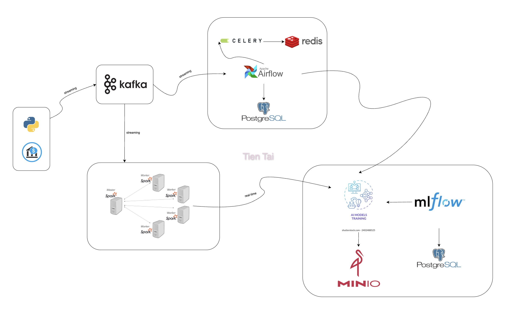

# 🚨 Fraud Detection System

A scalable **Machine Learning Fraud Detection System** with real-time inference, model lifecycle management, and automated retraining pipelines.  

---

## 📌 Overview

This system is designed to detect fraudulent transactions in **real-time** using **Apache Kafka** and **Apache Spark**, while ensuring a full **ML lifecycle** with experiment tracking, model registry, artifact storage, and retraining orchestration.  

---

## 🏗️ Architecture

**Main flow:**

1. **Real-time stream**: Transactions enter via **Kafka**.  
2. **Inference**: Spark Streaming applies ML models for fraud detection.  
3. **Training & Retraining**: Airflow orchestrates pipelines for data processing and model updates.  
4. **Model Management**: MLflow + MinIO handle model tracking and storage.  
5. **Infrastructure**: Dockerized services, monitored with Celery Flower, and metadata stored in PostgreSQL.  

---

## 🖼️ Architecture Diagram



---

## 🔧 Tech Stack & Roles

### 1. **Real-Time Detection**
- **Apache Kafka (Confluent Cloud)** → Transaction stream ingestion.  
- **Apache Spark** → Real-time fraud detection using trained models.  

### 2. **Model Lifecycle Management**
- **MLflow** → Experiment tracking, model registry, version control.  
- **MinIO (S3-compatible)** → Store models, datasets, logs.  
- **PostgreSQL** → Metadata DB for MLflow & Airflow.  

### 3. **Training & Retraining**
- **Apache Airflow** → Orchestrate ETL, training, evaluation, deployment pipelines.  
- **Celery + Redis** → Task queue for distributed execution.  
- **Celery Flower** → Monitor Airflow workers & task health.  

### 4. **Infrastructure & Development**
- **Python (3.9 local / 3.10 production)** → Core language for ML and services.  
- **Docker** → Containerization & CI/CD friendly deployment.  

---

## ⚙️ Workflow

1. **Transaction Stream**  
   → Kafka receives new transaction events.  
   → Spark Streaming applies ML model.  
   → Result (fraud / non-fraud) published to output topic.  

2. **Model Training & Retraining**  
   → Airflow DAG extracts and preprocesses data.  
   → Train ML model (Python, scikit-learn, etc.).  
   → Store artifacts in MinIO & register in MLflow.  
   → Promote best model to **Production**.  

3. **Monitoring**  
   → Airflow monitors DAGs.  
   → Celery Flower monitors workers & tasks.  
   → MLflow UI for experiment tracking & model performance.  

---

## 🚀 Deployment

All services are **Dockerized**. Example (docker-compose):

```bash
docker compose up -d
